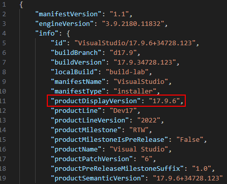

# VS Community 2022 SCCM pkg Deployment
Deployment or upgrade of VS 2022 Community using an SCCM package.

## Introduction
This repo provides the required information to deploy Visual Studio Community 2022 (VS2022) using a /System Center Configuration Manager (SCCM)/System Center Endpoint Manager (SCEM) package.

In many instances, deployment of VS2022 using an application doesn't work - deployment of any workload that includes the .Net redist will generate a failure message as the .Net redist fails to install correctly. After quite a lot of discussion with the VS Team (see https://developercommunity.visualstudio.com/t/Items-in-1774-fail-to-install-when-usi/10486002) the conclusion was that deployment of the .Net redist requires >512MB of memory, however this is the maximum provided by SCCM for an application deployment on the client machine and therefor installation of the .Net redist using an application deployment fails! The recommendation was to use a package deployment instead.

Note: I'd **MUCH** rather use an application deployment due to the control that it provides, however have not managed to find a way of increasing the available memory for an SCCM application deployment on the client - anyone know how we can do this?

The script and response files provided are therefore a way to reliably upgrade[^1] or install VS2022 using a package deployment from SCCM.

[^1]: I say upgrade, but what I really mean is removal of the current VS2022 instance, upgrade of the installer, then installation of the new version based on the required response file. This means that we remove anything that is no longer in support while keeping the installation up-to-date and has been the most reliable method during testing.

## Preparation
You'll need to do the following to prepare the required files:

1. Download the layout, copy to the required file server and create a share/ensure it's within your required structure
2. Add the installation script and response file(s) from this repo to the root of the layout.
3. Check the downloaded version and modify the PowerShell script to match the source location and the response file for your needs
4. Add a package installation to SCCM
5. Test the deployment

### 1. Layout Generation
Download the VS 2022 Community bootstrapper from https://visualstudio.microsoft.com/vs/community/. Copy it to a sensible location (bearing in mind that the space required for your workloads can be extensive). I use the 'C:\Support' folder for initial layout generation.

Run the bootstrapper to create a layout. The workloads you specify on the command-line will depend on what you need to install to the client machines. See https://learn.microsoft.com/en-us/visualstudio/install/workload-component-id-vs-community?view=vs-2022 for the list of available workloads for VS 2022 Community.

I use the following command line to download the required workloads for our deployment:

```
C:\Support\vs_community.exe --Layout C:\Support\VSCommunity2022 --includeRecommended --includeOptional --add Microsoft.VisualStudio.Workload.ManagedDesktop --add Microsoft.VisualStudio.Workload.ManagedGame --add Microsoft.VisualStudio.Workload.NetWeb --add Microsoft.VisualStudio.Workload.NativeDesktop --lang en-US
```

Once the download is complete, copy the layout to your required location. We create a separate share for each layout version as that simplifies the script.

**IMPORTANT**: Ensure that the permissions of the file share allow domain computers to access the files as the installation runs in the context of the machine account.

### 2. Add Installation Script and Response File(s) to the Layout
Copy the PowerShell installation script and any required response JSON files from this repo into the root of the layout folder you ahe created.

### 3. Version Check and Script Modification
Open the catalog.json file to check the downloaded version. I open this in Visual Studio Code, then press 'Shift + Alt + F' to make the file readable. You're looking for ProductDisplayVersion near the top of the file:



This is the version of VS2022 that will be installed from the layout. We include this version number in the share name for ease.

Modify the 'InstallOrUpgradeVisualStudio2022CommunityTo17.9.6-RemoveOldVersion.ps1' PowerShell script to reference the correct layout source location you're going to be using by changing 

```
$LayoutPath = "\\FileServer\VSCommunity2022-17.9.6"
```

To the correct source location.

Check, and if required, modify the response file you'll be using. The following is the response file we use for our base installation:

```
{
    "installChannelUri":".\\ChannelManifest.json",
    "channelUri":"https://aka.ms/vs/17/release/channel",
    "installCatalogUri":".\\Catalog.json",
    "channelId":"VisualStudio.17.Release",
    "productId":"Microsoft.VisualStudio.Product.Community",

    "noWeb": true,
    "noUpdateInstaller": true,
    "nocache": true, 
    "includeRecommended": true,
    "includeOptional": true,
    "quiet": true,
    "norestart": true,

    "add":[
        "Microsoft.VisualStudio.Workload.ManagedDesktop",
        "Microsoft.VisualStudio.Workload.ManagedGame",
        "Microsoft.VisualStudio.Workload.NetWeb"
    ],
    "addProductLang":["en-US"],
    "arch":"x64"
}
```

Use the workload list you looked at earlier for reference. Obviously it is important to only reference workloads you have downloaded to your layout in the response file as otherwise installation will generate an error.

Ensure that the PowerShell script references the correct response file, especially if you changed the file's name.

Check that the output logging options specified in the PowerShell script are suitable for your deployment scenario, and modify these if required.

### 4. Add a Package Installation to SCCM
Add a new package to SCCM. Do not check 'This package contains source files'. Select 'Standard program' from the program type options available, and use the following as the command line:

```
powershell.exe -ExecutionPolicy bypass -File "\\FileServer\VSCommunity2022-17.9.6\InstallOrUpgradeVisualStudio2022CommunityTo17.9.6-RemoveOldVersion.ps1"
```

Note: Modify the above command line to reflect the location from which you want to run the installer.

### 5. Test the Deployment
Ensure that you test the deployment before attempting to roll it out across your estate!


